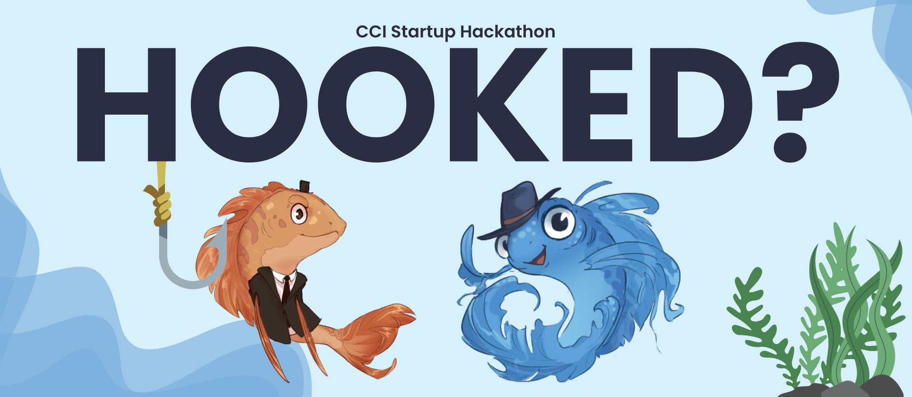

<p align="center">
  
</p>

# 🎣 Hooked?

**Hooked?** is a gamified, web-based cybersecurity and financial literacy platform that teaches users to recognize scams, make smarter financial decisions, and protect their digital identity through interactive simulations and story-driven learning paths.

---

## 👥 Team

| Name | Concentration | LinkedIn |
|------|----------------|-----------|
| **Benjamin Taylor** | M.S. Cybersecurity, B.S. Computer Science | [linkedin.com/in/btayl106](https://www.linkedin.com/in/btayl106/) |
| **Danila Maksimov** | B.S. Data Science | [linkedin.com/in/danmaks](https://www.linkedin.com/in/danmaks/) |
| **Johannah Raj** | B.S. Computer Science, Cybersecurity Concentration | [linkedin.com/in/johannah-raj/](https://www.linkedin.com/in/johannah-raj/) |
| **Julian Roberts** | B.S. Computer Science, Cybersecurity Concentration | [linkedin.com/in/julian-roberts-640935196/](https://linkedin.com/in/julian-roberts-640935196/) |

---

## 🌟 Features

- 🎮 Interactive phishing and finance simulations  
- 🔀 Two learning paths: **Financial Literacy** and **Cybersecurity**  
- ⚡ Real-time scoring, XP, and mascot feedback  
- 📊 Progress tracking for users (lives, gems, badges)  
- 🧩 Modular lesson structure with scalable expansion  
- ⚙️ HTMX-powered dynamic and responsive interactions  

---

## 🏗️ Project Structure (for reference)

```text
├── hooked/ # Main Flask application package
│ ├── blueprints/ # Flask blueprints for routes (main, learn, etc.)
│ ├── services/ # Lesson logic, simulation engines, and scoring
│ ├── static/ # Static assets (CSS, JS, images)
│ └── templates/ # Jinja2 HTML templates and UI components
├── fincipal/ # Static Principal Bank demo integration
├── data/ # JSON data files for lessons and scenarios
├── scripts/ # Utility and setup scripts
├── tests/ # Test suite (optional)
└── run.py # Entry point — launches Flask app and demo
```

---

## 🧠 Technology Stack

- **Backend:** Flask (Python)  
- **Frontend:** HTMX, Jinja2 Templates, TailwindCSS  
- **Database:** SQLite with SQLAlchemy ORM  
- **Authentication (planned):** Flask-Login  
- **Styling:** TailwindCSS + Custom Components  
- **Deployment:** Flask Dev Server / Gunicorn / Render  

---

## 🚀 Getting Started

> ⚠️ This repository is for **public demonstration only** — the production source code is private to protect ongoing development and partnerships.  
> Recruiters or collaborators interested in viewing or testing the platform can reach out directly.

### Prerequisites

- Python 3.10+  
- pip (Python package manager)

### Example Local Setup (for internal devs)

```bash
git clone https://github.com/betta-phish/hooked.git
cd hooked
python -m venv venv
source venv/bin/activate  # On Windows: venv\Scripts\activate
pip install -r requirements.txt
python run.py
```

Running locally opens the **Bank Demo** homepage, allowing navigation to the Hooked platform via the **“Investigate with Phishy”** link.

---

## 🧩 Core Systems

### Learning Paths
- **Financial Literacy:** Budgeting, credit, investing, saving  
- **Cybersecurity:** Phishing defense, scam awareness, fraud prevention

### Simulation Engine
- Realistic phishing inbox & email simulations  
- Smart-spending budgeting challenges  
- Adaptive difficulty scaling (Easy → Hard)  
- Real-time feedback from mascot *Phishy*  
- XP, gems, and progress tracking

### User Progress System
- Persistent **Lives** and **Gems** HUD  
- Level-by-level progression  
- Animated mascot reactions to success/failure  
- Metrics stored locally or in backend

---

## Key Components (architecture overview)
- `models.py` — Database models for progress, levels, and scoring  
- `lesson_engine.py` — Adaptive lesson logic & progression  
- `simulator_engine.py` — Phishing & finance simulation logic  
- `scoring.py` — XP, rewards, achievements

---

## 🏆 Acknowledgments
- 🥇 UNC Charlotte CCI Hackathon — **Team Betta Phish** (Most Creative Award)  
- Flask & HTMX open-source communities  
- Cybersecurity education initiatives advancing awareness

---

## 🔒 Code Access Policy
This repository is **public for visibility** but the codebase is **private** to protect ongoing development and educational intellectual property.

Recruiters, collaborators, or educators interested in early access may contact:  
📩 **Betta Phish** — [LinkedIn](https://www.linkedin.com/company/bettaphish) | <bettaphishstartup@gmail.com>

---

<p align="center">
  <sub>© 2025 Betta Phish · Built at UNC Charlotte · All rights reserved.</sub>
</p>


